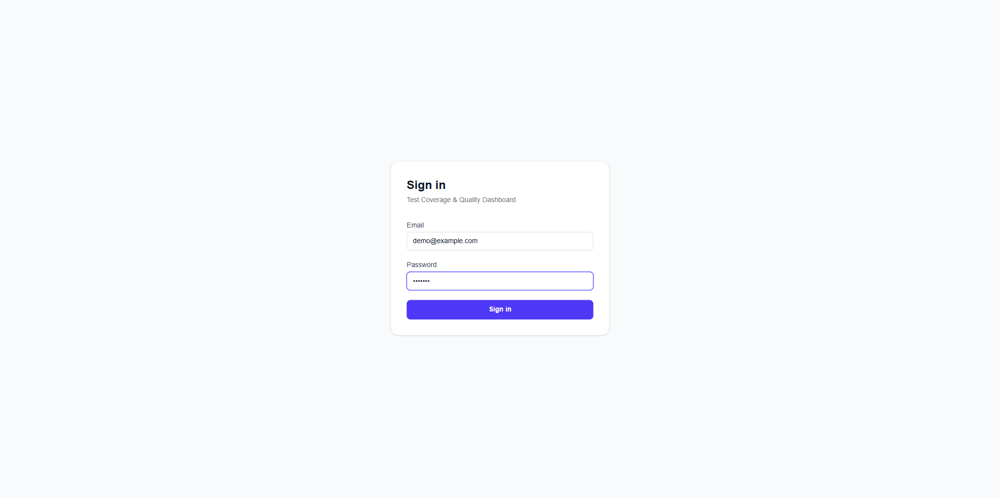

# Xray Dashboard

A production-ready quality management dashboard that integrates with Jira and Xray to deliver transparent test coverage monitoring and go-live readiness scoring.

## Screenshots

### Sign-in



## Features

- **Readiness Score**: KPI-driven 0-100 score with traffic-light tiers (GREEN/AMBER/RED)
- **Coverage Tracking**: Requirement-to-test mapping with drill-down views
- **Execution Progress**: Test plan execution status with flaky test detection
- **Defect Analysis**: Severity-weighted defect pressure monitoring
- **Demo Mode**: Fully functional with realistic mock data (no Jira/Xray required)

## Quick Start

### Prerequisites

- Node.js 18+
- Docker (for PostgreSQL) or a PostgreSQL 14+ instance

### Setup

1. Clone the repository and install dependencies:
   ```bash
   npm install
   ```

2. Copy and configure environment variables:
   ```bash
   cp .env.example .env
   ```
   Edit `.env` and set:
   - `DATABASE_URL` — PostgreSQL connection string
   - `NEXTAUTH_SECRET` — generate with `openssl rand -base64 32`
   - `DEMO_MODE=true` for mock data

3. Start PostgreSQL:
   ```bash
   docker-compose up -d
   ```

4. Run database migrations:
   ```bash
   npx prisma migrate dev
   ```

5. Seed demo data:
   ```bash
   npm run seed
   ```

6. Start the development server:
   ```bash
   npm run dev
   ```

7. Open [http://localhost:3000](http://localhost:3000) and login with:
   - Email: `demo@example.com`
   - Password: `demo123`

## Environment Variables

| Variable | Required | Description |
|----------|----------|-------------|
| `DATABASE_URL` | Yes | PostgreSQL connection string |
| `NEXTAUTH_SECRET` | Yes | Secret for JWT signing (32+ random bytes) |
| `NEXTAUTH_URL` | Yes | App base URL (e.g., `http://localhost:3000`) |
| `DEMO_MODE` | No | Set `true` to use mock data globally |

Jira/Xray credentials are configured per-project in the Settings UI and stored encrypted in the database.

## KPI Definitions

| KPI | Formula | Weight |
|-----|---------|--------|
| Coverage Rate | covered requirements / total requirements | 25% |
| Execution Progress | executed tests / planned tests | 20% |
| Pass Rate | PASS / all non-TODO executions | 25% |
| Automation Rate | automated test cases / all test cases | 10% |
| Defect Pressure | 1 - Σ(count × severity_weight) / normalizer | 20% |

**Readiness Score** = weighted sum × 100

**Tiers**: GREEN ≥ 75 · AMBER 50–74 · RED < 50

## Connecting to Jira + Xray

1. Navigate to **Settings** in the sidebar
2. Select your platform (Jira Cloud or Server)
3. Enter your base URL, email, and API token
4. Select your Xray type (Cloud or Server/DC)
5. Click **Test Connection** to verify credentials
6. Click **Sync Now** to import data

## Architecture

- **Next.js 14** App Router with TypeScript
- **PostgreSQL** + **Prisma** ORM
- **NextAuth v4** with JWT sessions
- **Adapter pattern**: `IProjectAdapter` → Mock / JiraXrayCloud / JiraXrayServer
- **KPI Engine**: Pure formula functions → snapshot to DB after every sync
- **Recharts**: All charts (RadialBar, Line, Pie, Bar)
